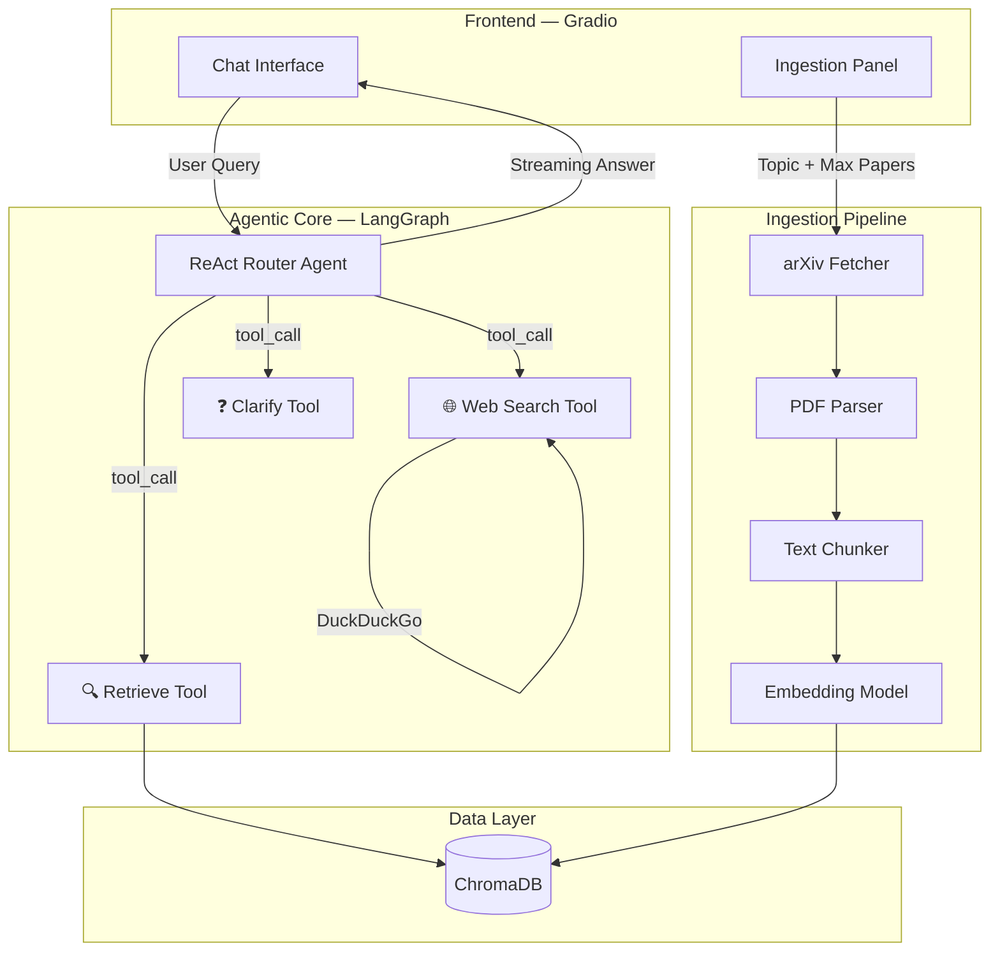

# 🔬 Agentic Research Assistant

An AI-powered research assistant that ingests arXiv papers, builds a RAG index, and uses a LangGraph ReAct agent with dynamic tool-calling to route queries across retrieval, web search, and clarification.

**Powered by:** Google Gemini 1.5 Flash · LangGraph · ChromaDB · Gradio

---

## ✨ Features

- **📥 arXiv Ingestion Pipeline** — Fetch papers by topic, parse PDFs to Markdown, chunk text, embed with Google's `text-embedding-004`, and store in ChromaDB
- **🤖 Agentic Query Router** — LangGraph ReAct agent that dynamically selects between three tools based on query intent
- **🔍 RAG Retrieval** — Cosine similarity search over ingested paper chunks with source citations
- **🌐 Web Search** — Free DuckDuckGo search for recent developments and context outside ingested papers
- **❓ Smart Clarification** — Asks for clarification when queries are too ambiguous
- **💬 Streaming Chat UI** — Real-time Gradio interface with tool-call visualization
- **📚 Multi-Topic Collections** — Separate ChromaDB collections per research topic
- **🐳 Docker Ready** — One-command deployment with Docker Compose

---

## 🏗️ Architecture



### Data Flow

1. **Ingestion**: Topic → arXiv API → PDF download → Markdown extraction → Text chunking → Embedding → ChromaDB
2. **Query Routing**: User question → LangGraph ReAct agent → Tool selection → Synthesized answer with citations

---

## 🛠️ Tech Stack

| Layer | Technology |
|:---|:---|
| **Language** | Python 3.11+ |
| **Agent Framework** | LangGraph + LangChain |
| **LLM** | Google Gemini 1.5 Flash |
| **Embeddings** | Google `text-embedding-004` (768-dim) |
| **Vector Database** | ChromaDB (persistent mode) |
| **PDF Parsing** | pymupdf4llm (layout-aware Markdown) |
| **Web Search** | DuckDuckGo (free, no API key) |
| **Frontend** | Gradio 6.x (Blocks API) |
| **Container** | Docker + Docker Compose |

---

## 🚀 Quick Start

### Prerequisites

- Python 3.11+
- A Google API key ([get one here](https://aistudio.google.com/apikey))

### 1. Clone the repository

```bash
git clone https://github.com/Mahoragaa/agentic-research-assistant.git
cd agentic-research-assistant
```

### 2. Set up environment

```bash
# Create and activate virtual environment
python -m venv venv
source venv/bin/activate  # On Windows: venv\Scripts\activate

# Install dependencies
pip install -r requirements.txt
```

### 3. Configure API key

```bash
# Copy the example env file
cp .env.example .env

# Edit .env and add your Google API key
# GOOGLE_API_KEY=your_actual_key_here
```

### 4. Run the application

```bash
python -m app.main
```

The app will be available at **http://localhost:7860**

---

## 🐳 Docker Deployment

### Using Docker Compose (recommended)

```bash
# Create your .env file first
cp .env.example .env
# Edit .env with your GOOGLE_API_KEY

# Build and run
docker compose up --build

# Run in background
docker compose up --build -d
```

### Using Docker directly

```bash
docker build -t agentic-research-assistant .

docker run -p 7860:7860 \
  --env-file .env \
  -v $(pwd)/data:/app/data \
  agentic-research-assistant
```

---

## 📖 Usage

### 1. Ingest Papers

1. Enter a research topic (e.g., "transformer architectures")
2. Set the number of papers to fetch (1–50, default: 25)
3. Click **🚀 Ingest Papers**
4. Watch the progress log as papers are fetched, parsed, chunked, and indexed

### 2. Ask Questions

Once papers are ingested:

- **Technical questions**: "What is the key contribution of the attention mechanism?" → Uses **Retrieve** tool
- **Recent developments**: "What are the latest state-of-the-art results?" → Uses **Web Search** tool
- **Ambiguous queries**: "Tell me about stuff" → Uses **Clarify** tool

### 3. Manage Collections

- Use the **Active Collection** dropdown to switch between topics
- **🔄 Refresh** to reload collections
- **🗑️ Delete** to remove a collection

---

## 📁 Project Structure

```
agentic-research-assistant/
├── app/
│   ├── __init__.py
│   ├── main.py                  # Application entry point
│   ├── config.py                # Pydantic Settings configuration
│   ├── ingestion/
│   │   ├── __init__.py
│   │   ├── fetcher.py           # arXiv API integration
│   │   ├── parser.py            # PDF → Markdown (pymupdf4llm)
│   │   ├── chunker.py           # Text splitting + metadata
│   │   ├── indexer.py           # ChromaDB collection management
│   │   └── pipeline.py          # E2E ingestion orchestrator
│   ├── agent/
│   │   ├── __init__.py
│   │   ├── graph.py             # LangGraph StateGraph definition
│   │   ├── state.py             # AgentState TypedDict
│   │   └── tools/
│   │       ├── __init__.py
│   │       ├── retrieve.py      # ChromaDB retrieval tool
│   │       ├── web_search.py    # DuckDuckGo search tool
│   │       └── clarify.py       # Clarification tool
│   └── ui/
│       ├── __init__.py
│       └── components.py        # Gradio Blocks UI layout
├── tests/
│   ├── conftest.py              # Shared pytest fixtures
│   ├── test_ingestion.py        # Ingestion pipeline tests
│   ├── test_tools.py            # Agent tool tests
│   └── test_agent.py            # Full agent integration tests
├── data/
│   └── chroma_db/               # Persistent ChromaDB storage
├── Dockerfile
├── docker-compose.yml
├── requirements.txt
├── .env.example
└── README.md
```

---

## ⚙️ Configuration

All settings are loaded from environment variables (`.env` file). Only `GOOGLE_API_KEY` is required.

| Variable | Required | Default | Description |
|:---|:---|:---|:---|
| `GOOGLE_API_KEY` | ✅ | — | Google AI Studio API key |
| `GEMINI_MODEL` | | `gemini-1.5-flash` | LLM model name |
| `EMBEDDING_MODEL` | | `models/text-embedding-004` | Embedding model |
| `CHROMA_PERSIST_DIR` | | `./data/chroma_db` | ChromaDB storage path |
| `DEFAULT_MAX_PAPERS` | | `25` | Default papers per ingestion |
| `CHUNK_SIZE` | | `1000` | Text chunk size (chars) |
| `CHUNK_OVERLAP` | | `200` | Chunk overlap (chars) |
| `LANGCHAIN_TRACING_V2` | | `false` | Enable LangSmith tracing |
| `LANGCHAIN_API_KEY` | | — | LangSmith API key |

---

## 🧪 Testing

```bash
# Run all tests
pytest tests/ -v

# Run specific test files
pytest tests/test_ingestion.py -v
pytest tests/test_tools.py -v
pytest tests/test_agent.py -v
```

---

## 📄 License

MIT License — see [LICENSE](LICENSE) for details.

---

## 🙏 Acknowledgments

- [Google Gemini](https://deepmind.google/technologies/gemini/) — LLM and embeddings
- [LangGraph](https://github.com/langchain-ai/langgraph) — Agent framework
- [ChromaDB](https://www.trychroma.com/) — Vector database
- [arXiv](https://arxiv.org/) — Open access research papers
- [Gradio](https://gradio.app/) — UI framework
